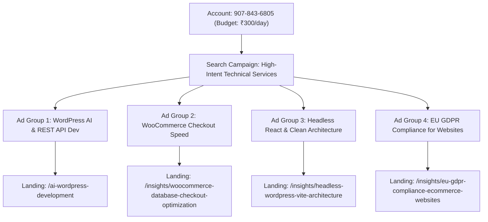

# Google Ads Configuration Blueprint: Account 907-843-6805

**Account ID:** `907-843-6805` (Normalized: `9078436805`)
**Daily Budget:** ₹300.00 / day
**Targeting Locations:**
* **India Urban (Tier-1 Tech Hubs):** Bengaluru, Mumbai, Delhi, Gurugram, Noida, Hyderabad, Pune, Chennai
* **EU Core Markets:** Germany (`DE`), Netherlands (`NL`), Ireland (`IE`), Sweden (`SE`), France (`FR`)
* **Western & Tier-1 Global:** United States, United Kingdom, Canada, Australia, Singapore, UAE
* **Targeting Mode:** Presence Only (People in or regularly in your targeted locations)
**Network:** Google Search Network Only (Search Partners & Display Expansion: **DISABLED**)
**Bidding Strategy:** Maximize Clicks with Max CPC Bid Cap = **₹45.00** (~$0.55)

---

## Campaign Structure (Tier 1 High-Intent Search)



---

## Strict Exact-Match Keyword Matrix (Zero Budget Waste)

Because daily budget is ₹300, we use **Exact Match only** `[...]` to guarantee no irrelevant queries trigger impressions:

### Ad Group 1: WordPress AI & REST API Dev
* `[custom api integration wordpress]`
* `[integrate openai with wordpress]`
* `[wordpress rest api developer]`
* `[custom wordpress webhook development]`
* `[connect crm to wordpress api]`

### Ad Group 2: WooCommerce Checkout Speed Fix
* `[woocommerce slow checkout fix]`
* `[fix woocommerce high ttfb]`
* `[woocommerce database bloat cleanup]`
* `[woocommerce rest api speed optimization]`

### Ad Group 3: Headless React & Clean Architecture
* `[headless wordpress react developer]`
* `[convert elementor to custom code]`
* `[enterprise wordpress refactoring]`

### Ad Group 4: EU GDPR Compliance & Consent Architecture
* `[gdpr audit for ecommerce]`
* `[gdpr for website]`
* `"gdpr compliance for woocommerce"`
* `"gdpr compliance website selling in eu"`
* `"google consent mode v2 implementation"`
* `"eu gdpr website compliance service"`
* `"cookie consent developer"`
* `"fix gdpr compliance website"`

---

## Universal Negative Keywords (Applied to Campaign)
```text
free
tutorial
course
learn
how to
github
stackoverflow
job
jobs
hiring
internship
salary
resume
career
fiverr
upwork login
cheap
nulled
cracked
template download
pdf
youtube
certification
exam
reddit
abhijeet
abhijeet rattan
makeyourwp
generatepress
avada
divi
breakdance
snapwp
frontity
elementor pro
shopify
animation
```

---

## Responsive Search Ads (RSAs)

### RSA 1: WordPress AI & Custom API Integration
* **Final URL:** `https://sarabjeetrattan.com/ai-wordpress-development`
* **Path 1 / Path 2:** `wordpress` / `custom-api`
* **Headlines:**
  1. `Custom WordPress API Dev`
  2. `Connect AI & CRMs in 48h`
  3. `Built by SSR | 16+ Yrs Exp`
  4. `Fix Broken REST Endpoints`
  5. `OpenAI WordPress Integration`
  6. `Zero Theme Bloat Code`
  7. `Fixed-Scope from $500`
  8. `Custom Webhook Engineering`
* **Descriptions:**
  1. `Struggling with slow APIs or broken webhooks? Custom full-stack WordPress engineering.`
  2. `Connect OpenAI, Stripe, CRMs & custom databases to your WordPress site. Get a quote.`
  3. `Zero theme bloat. Audit-proof lead routing and sub-50ms REST API response times.`
  4. `Fixed-scope diagnostics and production deployment in 7 to 14 days. Book a call.`

### RSA 2: WooCommerce Checkout Speed & Performance
* **Final URL:** `https://sarabjeetrattan.com/insights/woocommerce-database-checkout-optimization`
* **Path 1 / Path 2:** `woocommerce` / `speed-fix`
* **Headlines:**
  1. `Fix WooCommerce Slow Checkout`
  2. `Sub-800ms Checkout Speed`
  3. `Stop Losing Cart Revenue`
  4. `WooCommerce Speed Engineer`
  5. `Fix High TTFB in 48 Hours`
  6. `Database Bloat Cleanup`
  7. `Eliminate Slow AJAX Carts`
  8. `Fixed-Scope Fix from $500`
* **Descriptions:**
  1. `Every 500ms checkout delay drops sales. We eliminate database bloat and slow queries.`
  2. `HPOS migration, wp_options pruning, and Redis caching for high-volume WooCommerce.`
  3. `Sub-800ms uncached checkout response times. Guaranteed speed boost for DTC stores.`
  4. `Fixed-scope performance diagnostic. Get your store running fast in 48 hours.`

### RSA 3: Headless React & Custom Architecture
* **Final URL:** `https://sarabjeetrattan.com/insights/headless-wordpress-vite-architecture`
* **Path 1 / Path 2:** `headless` / `react`
* **Headlines:**
  1. `Headless WordPress React Dev`
  2. `Sub-500ms Core Web Vitals`
  3. `Zero Theme Bloat Execution`
  4. `Convert Elementor to Code`
  5. `Vite React SSG Architecture`
  6. `Modernize Legacy WordPress`
  7. `Enterprise Speed & Security`
  8. `Fixed Scope Architecture`
* **Descriptions:**
  1. `Outgrown slow page builders? Decouple WordPress with Vite and React for 99+ PageSpeed.`
  2. `Full-stack headless engineering: Instant static load times and impenetrable security.`
  3. `Keep WordPress CMS backend while delivering a lightning-fast React frontend.`
  4. `Custom API layer and zero plugin bloat. Discuss your headless migration today.`

### RSA 4: EU GDPR Compliance for Websites Selling in EU
* **Final URL:** `https://sarabjeetrattan.com/insights/eu-gdpr-compliance-ecommerce-websites`
* **Path 1 / Path 2:** `gdpr` / `compliance`
* **Headlines:**
  1. `EU GDPR Compliance Dev` *(Pinned: Pos 1)*
  2. `Sell in EU Without Fines`
  3. `Google Consent Mode v2`
  4. `GDPR Audit for eCommerce`
  5. `Zero-Leak Cookie Consent`
  6. `GDPR Dev | 16+ Yrs Exp`
  7. `Fix Non-Compliant Stores`
  8. `Fixed-Scope GDPR Setup`
* **Descriptions:**
  1. `Selling to EU customers? Ensure 100% legal compliance with bulletproof data architecture.`
  2. `Google Consent Mode v2 & zero-leak script blocking for WooCommerce & React stores.`
  3. `Avoid €20M penalties. We engineer audit-proof GDPR consent layers and privacy pipelines.`
  4. `Fixed-scope implementation in 48 to 72 hours. Protect your store & tracking accuracy.`
