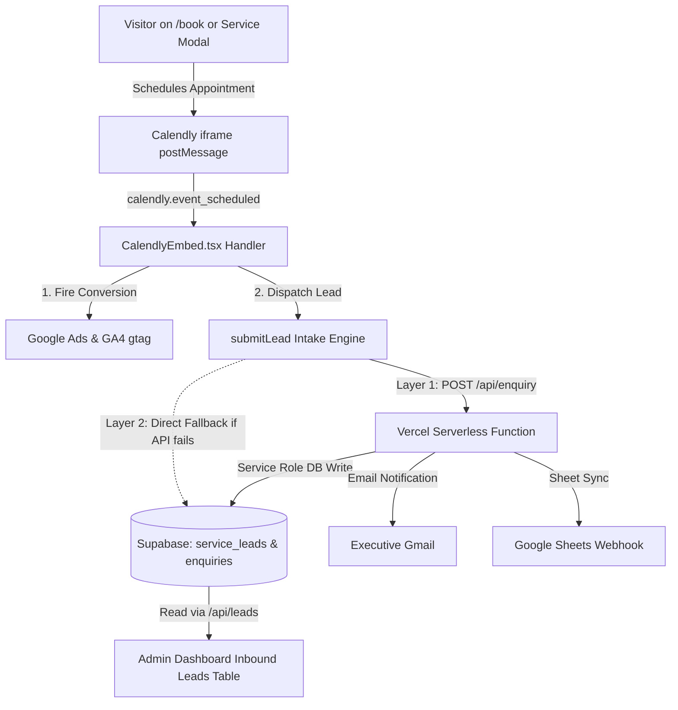

# Calendly Lead Capture & Conversion Tracking Architecture Plan

> **For Antigravity:** REQUIRED SUB-SKILL: Load `executing-plans` to implement this plan task-by-task.

**Goal:** Establish a secure, high-integrity pipeline for capturing inbound leads and tracking Google Ads & GA4 conversions across both embedded Calendly appointment bookings and native consultation forms, with zero secrets in client or version-controlled code, and automatic synchronization with the Supabase `service_leads` & `enquiries` tables.

**Architecture:** 
1. **Client-Side Event Listener**: The embedded Calendly widget communicates through postMessage (`calendly.event_scheduled`). The listener extracts booking data, triggers Google Ads (`AW-18490594666`) & GA4 conversion tags, and forwards the lead payload to `/api/enquiry`.
2. **Serverless Intake Layer (`/api/enquiry`)**: Reads credentials strictly from environment variables (`SUPABASE_URL`, `SUPABASE_SERVICE_ROLE_KEY`, `GMAIL_APP_PASSWORD`, `RECAPTCHA_SECRET_KEY`), securely saves to Supabase, dispatches instant email notifications to executive inbox, and syncs to Google Sheets webhook.
3. **Fail-Safe Fallback**: If the serverless endpoint is ever unreachable, the frontend falls back directly to the Supabase client inserting into `service_leads` and `enquiries` using the public Anon Key with matching schema.
4. **Admin Dashboard Consolidation (`/api/leads`)**: Deduplicates records by email and timestamp, ensuring exactly one consolidated row per lead in the executive portal.

**Tech Stack:** React 18, Vite (SSG), Supabase, Vercel Serverless Functions, Google Ads (`gtag.js`), Calendly Embed API.

---

## User Review Required

> [!IMPORTANT]
> **Vercel Project Environment Variables**:
> To ensure the serverless backend functions (`/api/enquiry` and `/api/leads`) operate without hardcoded fallback strings, ensure the following environment variables are set in your Vercel Project Settings (or `.env`):
> - `SUPABASE_URL`: `https://bwpemzjwrrszygszuitc.supabase.co`
> - `SUPABASE_SERVICE_ROLE_KEY`: `[Your secret service role JWT from Supabase Project Settings > API]`
> - `GMAIL_USER`: `sarabjit.rattan@gmail.com`
> - `GMAIL_APP_PASSWORD`: `[Your 16-character Google App Password]`
> - `RECAPTCHA_SECRET_KEY`: `6LdEubYsAAAAAET_zYg9Hz7oOGuIlFbUfJV1NKx2`
> - `GOOGLE_SHEETS_WEBHOOK_URL`: `[Optional Webhook URL]`

---

## Proposed Changes

---

### Phase 1: Clean Environment & Security Configuration

#### [MODIFY] `api/leads.ts`
- Remove all hardcoded secret keys.
- Read `SUPABASE_URL` and `SUPABASE_SERVICE_ROLE_KEY` strictly from `process.env`.
- Return sanitized unified leads with status 200.

#### [MODIFY] `api/enquiry.ts`
- Remove all hardcoded secret keys.
- Read credentials strictly from `process.env`.
- Validate required payload fields (`email`, `name`, `requirement`, `leadType`).

---

### Phase 2: Calendly Booking & Event Interception

#### [MODIFY] `src/components/CalendlyEmbed.tsx`
- Listen for `calendly.event_scheduled` message events from `calendly.com`.
- Parse `event.data` payload to extract invitee details (`name`, `email`, `event.uri`).
- Trigger `submitLead(...)` with `leadType: 'CALENDLY_BOOKING'`, `conversionLabel: 'calendly_appointment_confirmed'`, and `targetService: 'architecture-discovery-call'`.
- Fire `onBookingComplete` callback.

---

### Phase 3: Conversion Tracking Integration

#### [MODIFY] `src/lib/conversion.ts`
- Verify Google Ads Tag ID: `AW-18490594666`.
- Verify Conversion Label: `AW-18490594666/ilDICOGGnI4dEOqqgPFE`.
- Send `conversion` event to Google Ads and `generate_lead` to GA4 with proper value and currency (`INR`).
- Ensure `window.gtag` calls are safe against ad blockers (non-blocking).

---

### Phase 4: Verification & Live Testing

#### Automated Tests & Verification
1. **Typecheck & Build**: Run `npm run build` to verify zero SSG / TypeScript compilation errors.
2. **Endpoint Validation**: Test `/api/enquiry` and `/api/leads` endpoints via `curl` with proper request payloads.
3. **Live Conversion Verification**: Book a test slot or dispatch a test lead, and confirm:
   - Google Ads gtag event fires in browser console.
   - Lead appears in Supabase `service_leads` and `enquiries` tables.
   - Lead renders as `📅 CALENDLY CALL` row in `/admin` dashboard.
