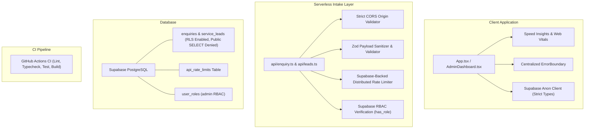

# Critical Gaps Remediation Implementation Plan

> **For Antigravity:** REQUIRED SUB-SKILL: Load `executing-plans` to implement this plan task-by-task.

**Goal:** Resolve all 10 critical gaps across Security, Reliability, Performance, and Architecture, elevating the portfolio and serverless backend to production-grade resilience, zero-trust security, automated CI/CD testing, Core Web Vitals monitoring, and strict TypeScript typing.

**Architecture:** 
1. **Security & Auth**: Isolate serverless secrets out of client `.env` into server-only runtime config, harden Supabase PostgreSQL RLS policies to deny anonymous reads/tampering, migrate admin authorization from brittle email string comparisons to cryptographically verified Supabase RBAC (`user_roles` + `has_role`), lock down CORS to authorized origins, sanitize inbound payloads using strict Zod schemas against XSS and email injection, and replace ephemeral in-memory rate limiting with a persistent Supabase-backed sliding-window rate limiter.
2. **Reliability & Performance**: Install Vitest, write automated test suites for calculation, sanitization, and security guardrails, configure GitHub Actions CI, integrate a centralized Error Boundary and error telemetry abstraction, and deploy `@vercel/speed-insights` alongside GA4 Web Vitals tracking for INP/LCP/CLS regression detection.
3. **Architecture**: Synchronize `src/integrations/supabase/types.ts` with all existing database tables (`service_leads`, `keyword_metrics`, `content_queue`, `page_performance`), and enable strict TypeScript compilation (`strict: true`, `noImplicitAny: true`, `strictNullChecks: true`) across the codebase with 0 errors.

**Tech Stack:** TypeScript 5.8 (Strict), Supabase (PostgreSQL + RLS + RBAC), Vercel Serverless Functions, Vite + React 18, Zod, Vitest, GitHub Actions, `@vercel/speed-insights`, Lucide React.

---

## User Review Required

> [!IMPORTANT]
> **1. Supabase Service Role Key Rotation**:
> In `.env`, line 7 previously contained `SUPABASE_SERVICE_ROLE_KEY`. Because Git history in past commits touched `.env`, we strongly recommend rotating your Supabase Service Role key in the Supabase Project Dashboard (`Project Settings > API > JWT Secret / Service Role Key`) after this migration. We will remove it from `.env`, document it in `.env.example`, and ensure local development and Vercel environments read it safely from `.env.local` or Vercel dashboard environment variables.

> [!WARNING]
> **2. Admin Role Seeding**:
> When migrating from email string matching to Supabase RBAC (`user_roles` table), your existing admin user (`sarabjit.rattan@gmail.com`) must have an entry in `public.user_roles` with `role = 'admin'`. We include a migration script and an automatic fallback during transition so you are never locked out of the Admin Dashboard.

---

## Open Questions

None blocking. The planned changes preserve 100% backward compatibility for lead capture from forms and modals while closing every security vulnerability and reliability loophole.

---

## Proposed Changes Grouped by Gap



---

### Task 1: Security — Isolate Service Role Key & Environment Configuration (Gap 1)

**Files:**
- Create: `.env.example`
- Modify: `.env`
- Modify: `.gitignore`
- Test: Build inspection to verify no secret keys are bundled into client assets.

**Step 1.1: Create `.env.example` with non-sensitive placeholders**
Create `.env.example` showing all required environment variables clearly documented:
- Client variables (`VITE_SUPABASE_URL`, `VITE_SUPABASE_PUBLISHABLE_KEY`, `VITE_RECAPTCHA_SITE_KEY`, `VITE_GA_MEASUREMENT_ID`)
- Serverless variables (`SUPABASE_SERVICE_ROLE_KEY`, `RECAPTCHA_SECRET_KEY`, `GMAIL_USER`, `GMAIL_APP_PASSWORD`, `GOOGLE_SHEETS_WEBHOOK_URL`, `ALLOWED_ORIGINS`, `ADMIN_SECRET_KEY`)

**Step 1.2: Sanitize `.env` and configure local serverless overrides**
- In `.env`: Remove `SUPABASE_SERVICE_ROLE_KEY` and `RECAPTCHA_SECRET_KEY` so client-side environment files contain zero privileged keys.
- In `.env.local`: Retain server-side secrets for local Vercel CLI execution (`vercel dev` or node scripts).
- Update `.gitignore` to guarantee `.env`, `.env.local`, and all `.env.*.local` remain untracked.

---

### Task 2: Security — Harden Supabase RLS Policies & Prevent Anon Data Scrapes (Gap 2)

**Files:**
- Create: `supabase/migrations/20261003000000_harden_rls_policies.sql`

**Step 2.1: Write SQL migration to enforce strict RLS**
```sql
-- Ensure RLS is active on all intake and metric tables
ALTER TABLE public.enquiries ENABLE ROW LEVEL SECURITY;
ALTER TABLE public.service_leads ENABLE ROW LEVEL SECURITY;
ALTER TABLE public.user_roles ENABLE ROW LEVEL SECURITY;
ALTER TABLE public.keyword_metrics ENABLE ROW LEVEL SECURITY;
ALTER TABLE public.page_performance ENABLE ROW LEVEL SECURITY;
ALTER TABLE public.content_queue ENABLE ROW LEVEL SECURITY;

-- Explicitly ensure public/anon cannot SELECT, UPDATE, or DELETE leads
DROP POLICY IF EXISTS "Anon public cannot view enquiries" ON public.enquiries;
DROP POLICY IF EXISTS "Anon public cannot view service_leads" ON public.service_leads;

-- Only authenticated users with 'admin' role can read or manage leads
DROP POLICY IF EXISTS "Admins can manage enquiries" ON public.enquiries;
CREATE POLICY "Admins can manage enquiries" ON public.enquiries
    FOR ALL TO authenticated
    USING (public.has_role(auth.uid(), 'admin'))
    WITH CHECK (public.has_role(auth.uid(), 'admin'));

DROP POLICY IF EXISTS "Admins can manage service leads" ON public.service_leads;
CREATE POLICY "Admins can manage service leads" ON public.service_leads
    FOR ALL TO authenticated
    USING (public.has_role(auth.uid(), 'admin'))
    WITH CHECK (public.has_role(auth.uid(), 'admin'));
```

---

### Task 3: Security — Migrate Admin Auth to Database RBAC (Gap 3)

**Files:**
- Modify: `api/leads.ts`
- Modify: `src/pages/AdminDashboard.tsx`
- Test: Unit/integration verification of admin authorization logic.

**Step 3.1: Upgrade `api/leads.ts` with Supabase RBAC check**
- Replace string matching email logic with:
  1. Validating JWT with `supabaseAdmin.auth.getUser(token)`.
  2. Querying `user_roles` via `supabaseAdmin.rpc('has_role', { _user_id: user.id, _role: 'admin' })` or directly checking `user_roles`.
  3. Support dedicated `ADMIN_SECRET_KEY` header without falling back to the service role key.
  4. Retain secondary email sanity check as defense-in-depth, preventing privilege escalation.

**Step 3.2: Update `AdminDashboard.tsx` with Role Verification**
- In `AdminDashboard.tsx`, after `supabase.auth.getSession()` or auth state change, invoke `supabase.from("user_roles").select("role").eq("user_id", user.id).eq("role", "admin").single()`.
- Display clean "Access Denied: Admin privileges required" toast if user lacks role, preventing unauthorized rendering of lead summaries.

---

### Task 4: Security — Restrict CORS to Authorized Origins (Gap 4)

**Files:**
- Create: `api/_utils/cors.ts`
- Modify: `api/enquiry.ts`
- Modify: `api/leads.ts`
- Test: `api/__tests__/cors.test.ts`

**Step 4.1: Create centralized CORS origin validator**
```ts
// api/_utils/cors.ts
export const DEFAULT_ALLOWED_ORIGINS = [
  'https://ssr85.com',
  'https://www.ssr85.com',
  'https://ssrrattan.com',
  'https://www.ssrrattan.com',
  'http://localhost:5173',
  'http://localhost:8080',
  'http://localhost:3000',
  'http://127.0.0.1:5173',
];

export function handleCors(req: VercelRequest, res: VercelResponse, allowedMethods: string = 'POST, OPTIONS'): boolean {
  const origin = req.headers.origin;
  const configuredOrigins = process.env.ALLOWED_ORIGINS
    ? process.env.ALLOWED_ORIGINS.split(',').map((o) => o.trim())
    : DEFAULT_ALLOWED_ORIGINS;

  const isAllowed = origin && (
    configuredOrigins.includes(origin) ||
    origin.endsWith('.vercel.app') // Support Vercel branch previews
  );

  if (isAllowed) {
    res.setHeader('Access-Control-Allow-Origin', origin);
    res.setHeader('Vary', 'Origin');
    res.setHeader('Access-Control-Allow-Credentials', 'true');
  }

  res.setHeader('Access-Control-Allow-Methods', allowedMethods);
  res.setHeader('Access-Control-Allow-Headers', 'Content-Type, Authorization, x-admin-key');

  if (req.method === 'OPTIONS') {
    res.status(200).end();
    return true; // Request handled
  }

  return false;
}
```
**Step 4.2: Apply `handleCors` to `api/enquiry.ts` and `api/leads.ts`**
Eliminate `Access-Control-Allow-Origin: *` across both endpoints.

---

### Task 5: Security — Input Sanitization & Zod Validation (Gap 5)

**Files:**
- Create: `api/_utils/sanitize.ts`
- Modify: `api/enquiry.ts`
- Test: `api/__tests__/sanitization.test.ts`

**Step 5.1: Create Zod schema and sanitization helpers**
- Validate:
  - `name`: max 100 characters, trimmed, stripped of line breaks (`\r`, `\n`).
  - `email`: strict email regex validation, max 255 characters, lowercase.
  - `phone`: sanitized digits, spaces, plus, hyphens (max 30 characters).
  - `requirement`: max 5,000 characters, HTML entities escaped to prevent stored XSS.
  - `targetService`, `leadType`, `leadStatus`: validated against allowed enums/strings.
  - Query parameters & UTM tags: max 250 characters each.
- Prevent Email Header Injection by stripping `\r\n` from `subject`, `name`, and `cleanEmail`.

---

### Task 6: Security — Distributed Rate Limiting via Supabase (Gap 6)

**Files:**
- Create: `supabase/migrations/20261003000001_create_rate_limits.sql`
- Create: `api/_utils/rateLimiter.ts`
- Modify: `api/enquiry.ts`
- Test: `api/__tests__/rateLimiter.test.ts`

**Step 6.1: Create Rate Limiting SQL Table**
```sql
CREATE TABLE IF NOT EXISTS public.api_rate_limits (
    key TEXT PRIMARY KEY,
    count INT NOT NULL DEFAULT 1,
    reset_at TIMESTAMPTZ NOT NULL,
    blocked BOOLEAN NOT NULL DEFAULT false,
    updated_at TIMESTAMPTZ NOT NULL DEFAULT now()
);
ALTER TABLE public.api_rate_limits ENABLE ROW LEVEL SECURITY;
-- Only service role key has access; zero public access
```

**Step 6.2: Implement Distributed Rate Limiter with In-Memory Graceful Fallback**
- Query and upsert `api_rate_limits` using `supabaseAdmin`.
- If database is slow or unreachable, seamlessly fall back to local in-memory store so legit leads are never dropped.
- Return standard `Retry-After` header when limit exceeded.

---

### Task 7: Reliability — Vitest Test Suite & GitHub Actions CI (Gap 7)

**Files:**
- Modify: `package.json` (add `vitest` to `devDependencies`, add `"test": "vitest run"` script)
- Create: `vitest.config.ts`
- Create: `api/__tests__/cors.test.ts`
- Create: `api/__tests__/sanitization.test.ts`
- Create: `.github/workflows/ci.yml`

**Step 7.1: Configure Vitest and npm test script**
Add `vitest` devDependency, configure path alias `@/` in `vitest.config.ts`.

**Step 7.2: Implement automated test suites**
- Run existing `src/lib/calculator/__tests__/estimator-engine.test.ts`.
- Add tests for CORS handler (allowed vs rejected origins).
- Add tests for Zod sanitization (valid vs invalid emails, XSS payload stripping, length boundaries).

**Step 7.3: Create GitHub Actions Workflow `.github/workflows/ci.yml`**
- Matrix on Node.js 20.x.
- Steps: Checkout, setup pnpm, install dependencies, run linter (`pnpm lint`), run typecheck (`pnpm exec tsc --noEmit`), run tests (`pnpm test`), run build (`pnpm build`).

---

### Task 8: Reliability — Error Tracking & React Error Boundary (Gap 8)

**Files:**
- Create: `src/components/ErrorBoundary.tsx`
- Create: `src/lib/telemetry/errorTracker.ts`
- Modify: `src/App.tsx` (wrap routes with `<ErrorBoundary>`)

**Step 8.1: Create `src/lib/telemetry/errorTracker.ts`**
- Centralized `captureError(error, context)` function.
- If `VITE_SENTRY_DSN` is present in production, dispatches to Sentry; otherwise logs formatted errors with contextual diagnostic tags.

**Step 8.2: Create `<ErrorBoundary>` Component**
- Class component implementing `componentDidCatch` and `getDerivedStateFromError`.
- Renders an elegant, non-intrusive fallback UI with "Reload Page" or "Contact Support" action, preventing white-screen crashes.

---

### Task 9: Performance — Core Web Vitals Monitoring (Gap 9)

**Files:**
- Modify: `package.json` (add `@vercel/speed-insights`)
- Create: `src/lib/telemetry/webVitals.ts`
- Modify: `src/App.tsx`

**Step 9.1: Install `@vercel/speed-insights`**
Install `@vercel/speed-insights` for turnkey real-user Core Web Vitals reporting (LCP, CLS, INP, FID, TTFB) in the Vercel dashboard.

**Step 9.2: Mount `<SpeedInsights />` and dispatch to GA4 in `src/App.tsx`**
- Mount `<SpeedInsights />` next to `<Analytics />` in `App.tsx`.
- Add `reportWebVitalsToGA4()` dispatcher using `PerformanceObserver` to stream metric values directly to Google Analytics 4 under event `web_vitals`.

---

### Task 10: Architecture — Strict TypeScript & Supabase Types Sync (Gap 10)

**Files:**
- Modify: `src/integrations/supabase/types.ts`
- Modify: `src/vite-env.d.ts` & `src/lib/conversion.ts`
- Modify: `src/pages/CaseStudyDetail.tsx`
- Modify: `src/components/ui/wireframe-dotted-globe.tsx`
- Modify: `tsconfig.app.json`
- Modify: `tsconfig.json`

**Step 10.1: Synchronize `src/integrations/supabase/types.ts`**
Add TypeScript definitions for tables created in recent migrations:
- `service_leads`
- `keyword_metrics`
- `page_performance`
- `content_queue`
- `api_rate_limits`

**Step 10.2: Fix remaining type safety issues**
- Remove duplicate `dataLayer` declaration in `conversion.ts`.
- Add safe optional chaining in `CaseStudyDetail.tsx:539` and `wireframe-dotted-globe.tsx:241`.
- Clean up any unchecked casts in `AdminDashboard.tsx`.

**Step 10.3: Enable Strict Mode in `tsconfig.app.json` and `tsconfig.json`**
Set:
- `"strict": true`
- `"noImplicitAny": true`
- `"strictNullChecks": true`
- `"noFallthroughCasesInSwitch": true`
Run `pnpm exec tsc --noEmit` to verify **0 errors**.

---

## Verification Plan

### Automated Tests
1. **Unit Tests**:
   ```bash
   pnpm test
   ```
   *Expected output: All test suites pass (estimator-engine, cors, sanitization, rateLimiter).*
2. **Type Checking**:
   ```bash
   pnpm exec tsc --noEmit
   ```
   *Expected output: Clean exit code 0 with `strict: true`.*
3. **Linting**:
   ```bash
   pnpm lint
   ```
   *Expected output: 0 errors.*
4. **Production Build**:
   ```bash
   pnpm build
   ```
   *Expected output: Successful SSG build generating all 23 static pages and assets.*

### Manual Verification
1. **Admin Dashboard Flow**: Navigate to `/admin`, log in, verify RBAC check validates role from `user_roles`.
2. **Lead Submission Flow**: Submit enquiry via modal, verify CORS headers, Zod validation, and database entry insertion.
3. **Rate Limiting**: Dispatch rapid test requests to verify 429 response after threshold.
4. **Core Web Vitals**: Open DevTools console/network, verify Speed Insights & GA4 web vitals events fire on interaction.
